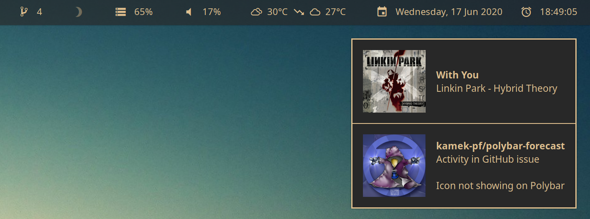
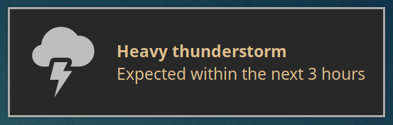
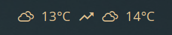
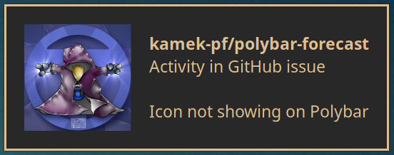
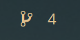
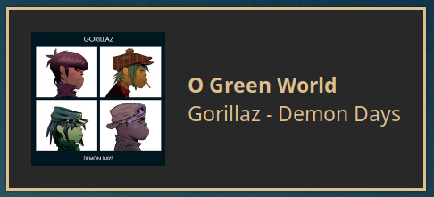

# `ntfd` - Notification daemon

[](https://github.com/kamek-pf/ntfd)

A lightweight notification daemon for fancy desktop integrations.

`ntfd` synchronizes with different services and offers synchronous APIs for desktop integration via D-Bus. \
It can be used as a data source for [Polybar](https://github.com/polybar/polybar), [Rofi](https://github.com/davatorium/rofi) or any other similar tool.

<p align="center">
    
    <sub>ntfd feeding data to Polybar and Dunst</sub>
</p>

## Installation
Arch users can install [`ntfd-bin`](https://aur.archlinux.org/packages/ntfd-bin/) from the AUR. \
Other Linux users can either grab a statically linked binary from the [release page](https://github.com/kamek-pf/ntfd/releases) or build from source. \
Instructions to build from source can be found at the bottom of the README.

## Configuration
If you installed from the AUR, just edit `~/.config/ntfd/config.toml` as you need and enable the modules you're interested in. \
Keep scrolling for module specific instructions.

If you're building from source, copy `config.toml` into your config directory, then edit it to enable what you need:
```sh
mkdir -p ~/.config/ntfd
cp config.toml ~/.config/ntfd
```

## Usage
First, make sure `ntfd` is running in the background. You can start it at the begining of you session:
```sh
ntfd &
```

Here are a few example DBus queries you can use from shell scripts, you'll need [`jq`](https://www.archlinux.org/packages/community/x86_64/jq/) to run the examples:

DBus properties:
```sh
# Get the current weather icon
busctl --user -j get-property io.ntfd /weather openweathermap.strings CurrentIcon | jq -r .data

# Rendered version of the configured weather template:
busctl --user -j get-property io.ntfd /weather openweathermap.strings RenderedTemplate | jq -r .data
```

DBus methods:
```sh
# Supported units are "celsius", "kelvin" and "fahrenheit":

# Current temperature in celsius:
busctl --user -j call io.ntfd /weather openweathermap.strings CurrentTemperature s "celsius" | jq -r '.data[0]'

# Forecast temperature in fahrenheit:
busctl --user -j call io.ntfd /weather openweathermap.strings CurrentTemperature s "fahrenheit" | jq -r '.data[0]'
```

To explore the DBus API, I recommend [`d-feet`](https://www.archlinux.org/packages/community/any/d-feet/), a graphical tool to explore DBus interfaces. \
In `d-feet`, go to the Session Bus tab from the top bar, and look for `io.ntfd`.

The [`busctl` documentation](https://www.freedesktop.org/software/systemd/man/busctl.html) might also come in handy, especially for method calls.

## Weather module
<p align="center">
    
</p>
<p align="center">
    
</p>

The weather module sends desktop notifications when weather conditions are degrading. \
It also exposes a D-Bus API with some convenience methods for easier desktop integration.

#### Polybar integration
In the screenshot, the first number is the current temperature and the second one is a 3 hour forecast. \
The output is fully configurable via templating, you can also query individual values. \
Edit the `~/.config/ntfd/config.toml` and follow the instructions. \
For Polybar integration like in the example, update your Polybar config like so:
```
[module/weather]
type = custom/script
exec = busctl --user -j get-property io.ntfd /weather openweathermap.strings RenderedTemplate | jq -r .data
interval = 60
label-font = 3
```
I recommend a 60 second interval, this way the bar will stay in sync with the notifications. \
Note that the Polybar integration depends on both [Weather Icons](https://aur.archlinux.org/packages/ttf-weather-icons) and [Material Icons](https://aur.archlinux.org/packages/ttf-material-design-icons), don't forget to add them to your config or it won't render correctly:
```
font-1 = WeatherIcons:size=17
...
font-3 = MaterialIcons:size=19
...
```

## GitHub module
<p align="center">
    
</p>
<p align="center">
    
</p>

The GitHub module sends desktop notifications when there's activity on GitHub. \
It exposes a D-Bus similar to the weather module.

#### Polybar integration
The screenshots shows the number of currently unread notifications. Nothing is rendered unless some notifications are unread. \
Edit the `~/.config/ntfd/config.toml` and follow the instructions. \
For Polybar integration like in the example, update your Polybar config like so:
```
[module/github]
type = custom/script
exec = busctl --user -j get-property io.ntfd /github github.strings RenderedTemplate | jq -r .data
interval = 10
label-font = 3
```
I recommend a 10 second interval, this way the bar will stay in sync with the notifications. \
The example in the default config file needs the Octicons font to render correctly.

## MPD module
<p align="center">
    
</p>

The MPD module sends desktop notifications when songs start playing. \
See `config.toml` for configuration options.

## Roadmap
Integration with the following services is planned:
- [x] OperweatherMap
    - [x] Current weather, forecast
    - [x] Template rendering for Polybar integration
    - [x] Re-implement [`polybar-forecast`](https://github.com/kamek-pf/polybar-forecast))
    - [x] Alerts through notifications
- [x] MPD
    - [x] Desktop notifications
- [x] Github
    - [x] Unread notifications count
    - [x] Live notifications
- [ ] Arch
    - [ ] Pacman updates ? (how ?)
- [ ] Gmail
    - [ ] Live notifications
    - [ ] Unread messages count, multi account support
- [ ] Facebook (?)
    - [ ] Live messages (?)
    - [ ] Unread notifications count (?)
- [ ] Twitch
    - [ ] Live streams count (followed by the user)
    - [ ] Rofi integration with [`mpv`](https://mpv.io/)
- [ ] Reddit (?)

## Build from source
You can setup a Stack toolchain to build the project, or use Docker to build a statically linked executable:
```sh
docker build -t kamek-pf/ntfd .
docker run --rm -ti -v $(pwd):/mnt kamek-pf/ntfd /bin/sh -c 'cp ntfd /mnt'
```
The binary will be available as `ntfd` from the project's root.

## Run tests
The test suite expects a valid `OWM_API_KEY` and `GITHUB_TOKEN` environment variables. Simply run `stack test`.

## Troubleshooting

##### My Dunst notification icons look tiny
Dunst has [an unreleased](https://github.com/dunst-project/dunst/pull/674) fix for this.
In the meantime you can copy the `weather-xyz` icons from \
`/usr/share/icons/YourTheme/status/symbolic` somewhere else, resize them and add the new path to `icon_folders` in your `dunstrc`.
